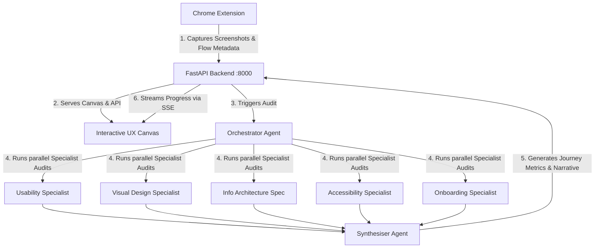

# Aux_ai 🚀
> **Aux_ai** is an advanced agentic AI-powered UX evaluation suite. It enables product teams, designer developers, and researchers to capture user journeys step-by-step using a Chrome Extension, map state-based UI flows, and trigger automated multi-agent heuristic audits that evaluate Usability, Accessibility, Visual Design, Information Architecture, and Onboarding.

---

## 🌟 Key Features

- 📸 **Seamless Step-by-Step Capture**: Chrome extension capturing DOM, triggers, URL states, and screenshot sequences.
- 🤖 **Orchestrated Multi-Agent Audit**: Uses 5 specialist AI agents powered by Gemini to perform parallel evaluations:
  - **Usability Specialist**: Evaluates interaction friction, clarity of layout, and standard UI heuristics.
  - **Visual Design Specialist**: Assesses typography, spacing, hierarchy, consistency, and alignment.
  - **Information Architecture Specialist**: Audits navigation flows, label groupings, and user mental model alignments.
  - **Accessibility Specialist**: Flags contrast, size readability, accessibility controls, and screen-reader friendliness.
  - **Onboarding Specialist**: Examines the learning curve, cognitive load, and time-to-value for new users.
- 🧠 **Smart Synthesis & Narrator**: Synthesizes the specialist audits into a single journey-level report, scoring flows and identifying critical severity bottlenecks.
- 📊 **Interactive UX Canvas**: A dynamic local visual studio to browse capturing sessions, inspect interactive screen-by-screen analyses, and generate complete HTML reports.
- ⚡ **Real-time Streaming (SSE)**: Streams progress events from the backend to the canvas in real-time as agents compile findings.

---

## 🏗️ Architecture & Flow



---

## 🛠️ Project Structure

```text
Aux_ai/
├── agents/                  # Heuristic Specialist & Orchestrator Agents
│   ├── flow/                # Journey-level analysis agents & synth
│   ├── specialists/         # The 5 domain-specific UX audit agents
│   ├── orchestrator.py      # Selects which agents run based on screen context
│   └── synthesiser.py       # Combines specialist output into unified findings
├── extension/               # Chrome Extension (Manifest V3) for UI capture
│   ├── background.js
│   ├── content.js
│   └── popup.js / popup.html
├── static/                  # Static assets for the Canvas UI (CSS/JS)
├── templates/               # HTML Jinja2 templates (index & canvas views)
├── training/                # RAG Knowledge-Base ingest & database scripts
├── capture.py               # Playwright/CLI screenshot helpers
├── evaluate.py              # Single-screen multi-agent evaluation runner
├── server.py                # FastAPI Core Application server
├── start_server.sh          # Launcher script (venv activation + uvicorn)
└── requirements.txt         # Core Python dependencies
```

---

## 🚦 Getting Started

### 1. Prerequisites
- **Python**: version `3.11.x`
- **Gemini API Key**: Set in your environment variables or a local `.env` file.
- **GitHub CLI** (optional): For version control commands.

### 2. Setup the Backend
Clone the repository and run the setup script:

```bash
# Activate your python virtualenv (or recreate if starting fresh)
python3.11 -m venv venv
source venv/bin/activate

# Install all required packages
pip install -r requirements.txt

# Configure your API key
echo "GEMINI_API_KEY=your_key_here" > .env
```

### 3. Launch the Server
Execute the launch script to start the FastAPI server:

```bash
chmod +x start_server.sh
./start_server.sh
```
The server will boot on **`http://127.0.0.1:8000`**.

### 4. Install the Chrome Extension
1. Open Google Chrome and navigate to `chrome://extensions/`.
2. Toggle **Developer mode** (top-right switch).
3. Click **Load unpacked** (top-left button).
4. Select the `extension/` directory from the `Aux_ai` project folder.
5. The extension icon will now appear in your browser toolbar!

---

## 💻 Tech Stack

- **Backend**: FastAPI, Uvicorn, SSE Starlette
- **AI Core**: Google GenAI / Gemini API
- **Vector DB / RAG**: Chromadb (for training reference and knowledge retrieve)
- **Frontend / UI**: HTML5, Jinja2, Vanilla CSS (dynamic glassmorphism, responsive grid)
- **Tooling**: Playwright, Pillow (PIL)

---

## 🤝 Contributing & Customization

### Adding custom heuristics
To customize or add specialist agents, navigate to `agents/specialists/`. Each specialist defines custom system prompts and evaluation categories:
- Modify prompt templates to change auditing standards.
- Adjust weights or evaluation variables in the synthesiser at `agents/synthesiser.py`.
